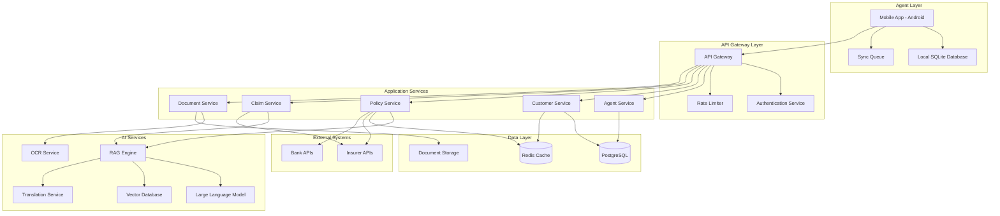

# Design Document: AI-Powered Rural Insurance Platform

## Overview

The AI-Powered Rural Insurance Platform is a three-tier system consisting of a mobile application for agents, a backend API layer with AI services, and integration connectors to insurer systems. The architecture prioritizes offline-first operation, multilingual AI capabilities, and simple user experiences suitable for low digital literacy users.

The system leverages Large Language Models (LLMs) with Retrieval-Augmented Generation (RAG) to provide intelligent policy recommendations and claims guidance. All AI-generated content is translated into regional languages to ensure accessibility. The platform is designed to operate effectively in rural environments with intermittent connectivity through local data caching and background synchronization.

## Architecture

### High-Level Architecture



### Deployment Architecture

The platform uses a cloud-native architecture with the following components:

- **Mobile Application**: Progressive Web App (PWA) or native Android app with offline-first capabilities
- **API Gateway**: Load-balanced REST API with authentication and rate limiting
- **Application Services**: Microservices deployed in containers (Kubernetes)
- **AI Services**: Separate scaling group for compute-intensive AI operations
- **Data Layer**: Managed database services with automated backups
- **CDN**: Content delivery network for static assets and cached translations

### Offline-First Design

The mobile application implements an offline-first architecture:

1. All user actions are stored locally in SQLite
2. Background sync service monitors connectivity
3. When online, queued actions are synchronized in order
4. Conflict resolution uses last-write-wins with manual override option
5. Critical data (customer records, policy summaries) is cached locally
6. AI features gracefully degrade when offline (show cached recommendations)

## Components and Interfaces

### 1. Mobile Application

**Technology Stack:**
- Framework: React Native or Flutter for cross-platform support
- Local Database: SQLite with encryption
- State Management: Redux or MobX
- Offline Sync: Custom sync engine with queue management

**Key Modules:**

**Authentication Module:**
```typescript
interface AuthenticationModule {
  login(username: string, password: string, otp: string): Promise<AuthToken>
  logout(): Promise<void>
  refreshToken(token: AuthToken): Promise<AuthToken>
  biometricLogin(): Promise<AuthToken>
}
```

**Customer Management Module:**
```typescript
interface CustomerManagementModule {
  createCustomer(data: HouseholdData): Promise<Customer>
  updateCustomer(id: string, data: Partial<HouseholdData>): Promise<Customer>
  searchCustomers(query: string): Promise<Customer[]>
  getCustomerProfile(id: string): Promise<CustomerProfile>
  getCustomerPolicies(id: string): Promise<Policy[]>
}

interface HouseholdData {
  name: string
  age: number
  occupation: string
  monthlyIncome: number
  familyMembers: FamilyMember[]
  address: Address
  riskFactors: RiskFactor[]
  language: LanguageCode
}

interface FamilyMember {
  name: string
  age: number
  relationship: string
  occupation?: string
}
```

**Policy Recommendation Module:**
```typescript
interface PolicyRecommendationModule {
  getRecommendations(householdData: HouseholdData): Promise<PolicyRecommendation[]>
  explainPolicy(policyId: string, language: LanguageCode): Promise<PolicyExplanation>
  comparePolices(policyIds: string[]): Promise<PolicyComparison>
}

interface PolicyRecommendation {
  policyId: string
  policyName: string
  relevanceScore: number
  monthlyCost: number
  coverageAmount: number
  keyBenefits: string[]
  explanation: string
  language: LanguageCode
}

interface PolicyExplanation {
  simplifiedTerms: string
  coverageDetails: string
  exclusions: string
  claimProcess: string
  examples: string[]
}
```

**Document Capture Module:**
```typescript
interface DocumentCaptureModule {
  captureDocument(type: DocumentType): Promise<DocumentImage>
  processDocument(image: DocumentImage): Promise<ExtractedData>
  validateDocument(data: ExtractedData): Promise<ValidationResult>
  retakeDocument(documentId: string): Promise<DocumentImage>
}

interface DocumentImage {
  id: string
  type: DocumentType
  imageData: Blob
  captureTimestamp: Date
}

interface ExtractedData {
  documentType: DocumentType
  fields: Record<string, string>
  confidence: number
  requiresReview: boolean
}

enum DocumentType {
  AADHAAR = "aadhaar",
  PAN = "pan",
  VOTER_ID = "voter_id",
  RATION_CARD = "ration_card",
  INCOME_CERTIFICATE = "income_certificate",
  ADDRESS_PROOF = "address_proof"
}
```

**Claims Support Module:**
```typescript
interface ClaimsSupportModule {
  initiateClaim(customerId: string, policyId: string): Promise<ClaimSession>
  getClaimGuidance(claimSession: ClaimSession): Promise<ClaimGuidance>
  validateClaimEligibility(claimSession: ClaimSession): Promise<EligibilityResult>
  submitClaim(claimSession: ClaimSession): Promise<ClaimSubmission>
}

interface ClaimSession {
  id: string
  customerId: string
  policyId: string
  incidentDate: Date
  incidentDescription: string
  claimAmount: number
  documents: DocumentImage[]
}

interface ClaimGuidance {
  steps: ClaimStep[]
  requiredDocuments: DocumentType[]
  estimatedProcessingTime: number
  tips: string[]
  language: LanguageCode
}

interface ClaimStep {
  stepNumber: number
  instruction: string
  completed: boolean
  validationRules: string[]
}
```

### 2. API Gateway

**Technology:** Kong, AWS API Gateway, or Nginx

**Responsibilities:**
- Request routing to appropriate microservices
- Authentication and authorization (JWT tokens)
- Rate limiting (per agent, per endpoint)
- Request/response logging
- API versioning
- CORS handling

**Endpoints:**

```
POST   /api/v1/auth/login
POST   /api/v1/auth/logout
POST   /api/v1/auth/refresh

GET    /api/v1/customers
POST   /api/v1/customers
GET    /api/v1/customers/:id
PUT    /api/v1/customers/:id
GET    /api/v1/customers/:id/policies

POST   /api/v1/recommendations
GET    /api/v1/policies/:id/explain
POST   /api/v1/policies/compare

POST   /api/v1/documents/upload
POST   /api/v1/documents/process
GET    /api/v1/documents/:id

POST   /api/v1/claims
GET    /api/v1/claims/:id/guidance
POST   /api/v1/claims/:id/validate
POST   /api/v1/claims/:id/submit

POST   /api/v1/sync
GET    /api/v1/sync/status
```

### 3. RAG Engine

**Technology Stack:**
- LLM: GPT-4, Claude, or Llama 2 (fine-tuned for insurance domain)
- Vector Database: Pinecone, Weaviate, or Qdrant
- Embedding Model: sentence-transformers or OpenAI embeddings
- Framework: LangChain or LlamaIndex

**Architecture:**

```mermaid
graph LR
    Query[User Query] --> Embed[Embedding Generator]
    Embed --> Search[Vector Search]
    Search --> VectorDB[(Vector Database)]
    VectorDB --> Retrieve[Retrieved Documents]
    Retrieve --> Context[Context Builder]
    Context --> Prompt[Prompt Constructor]
    Prompt --> LLM[Large Language Model]
    LLM --> Response[Generated Response]
    Response --> Translate[Translation Service]
    Translate --> Output[Localized Output]
```



**RAG Pipeline:**

```python
class RAGEngine:
    def __init__(self, llm, vector_db, embedding_model, translator):
        self.llm = llm
        self.vector_db = vector_db
        self.embedding_model = embedding_model
        self.translator = translator
    
    def recommend_policies(self, household_data: HouseholdData) -> List[PolicyRecommendation]:
        # Convert household data to query
        query = self._construct_query(household_data)
        
        # Generate embedding
        query_embedding = self.embedding_model.encode(query)
        
        # Retrieve relevant policies
        relevant_policies = self.vector_db.search(
            query_embedding, 
            top_k=10,
            filters={"status": "active"}
        )
        
        # Build context from retrieved policies
        context = self._build_context(relevant_policies)
        
        # Generate recommendations with LLM
        prompt = self._construct_recommendation_prompt(household_data, context)
        llm_response = self.llm.generate(prompt)
        
        # Parse and rank recommendations
        recommendations = self._parse_recommendations(llm_response)
        
        # Translate to target language
        if household_data.language != "en":
            recommendations = self._translate_recommendations(
                recommendations, 
                household_data.language
            )
        
        return recommendations
    
    def explain_policy(self, policy_id: str, language: LanguageCode) -> PolicyExplanation:
        # Retrieve policy document
        policy_doc = self.vector_db.get_document(policy_id)
        
        # Generate simplified explanation
        prompt = self._construct_explanation_prompt(policy_doc)
        explanation = self.llm.generate(prompt)
        
        # Translate if needed
        if language != "en":
            explanation = self.translator.translate(explanation, target_lang=language)
        
        return explanation
    
    def guide_claim(self, claim_session: ClaimSession) -> ClaimGuidance:
        # Retrieve policy terms
        policy_doc = self.vector_db.get_document(claim_session.policy_id)
        
        # Extract relevant claim clauses
        claim_context = self._extract_claim_context(
            policy_doc, 
            claim_session.incident_description
        )
        
        # Generate step-by-step guidance
        prompt = self._construct_claim_guidance_prompt(claim_session, claim_context)
        guidance = self.llm.generate(prompt)
        
        # Validate claim eligibility
        eligibility = self._validate_eligibility(claim_session, policy_doc)
        
        return ClaimGuidance(
            steps=guidance.steps,
            required_documents=guidance.documents,
            eligibility=eligibility
        )
```

**Vector Database Schema:**

```python
class PolicyDocument:
    id: str
    policy_name: str
    insurer_id: str
    policy_type: str  # life, health, crop, vehicle, property
    content: str  # Full policy text
    embedding: List[float]  # Vector embedding
    metadata: Dict[str, Any]
    status: str  # active, inactive, discontinued
    version: int
    created_at: datetime
    updated_at: datetime

class PolicyChunk:
    id: str
    policy_id: str
    chunk_text: str
    embedding: List[float]
    section: str  # coverage, exclusions, claims, premiums
    chunk_index: int
```

### 4. Translation Service

**Technology:**
- Primary: Google Cloud Translation API or Azure Translator
- Fallback: Custom fine-tuned models for insurance terminology
- Caching: Redis for frequently translated phrases

**Supported Languages:**
- Hindi, Bengali, Telugu, Marathi, Tamil, Gujarati, Urdu, Kannada, Odia, Malayalam, Punjabi

**Translation Pipeline:**

```python
class TranslationService:
    def __init__(self, primary_api, fallback_model, cache):
        self.primary_api = primary_api
        self.fallback_model = fallback_model
        self.cache = cache
        self.terminology_db = self._load_insurance_terminology()
    
    def translate(self, text: str, target_lang: LanguageCode) -> str:
        # Check cache first
        cache_key = f"{hash(text)}:{target_lang}"
        if cached := self.cache.get(cache_key):
            return cached
        
        # Replace insurance terms with standardized translations
        text_with_terms = self._replace_terminology(text, target_lang)
        
        # Translate using primary API
        try:
            translated = self.primary_api.translate(
                text_with_terms, 
                target=target_lang,
                source="en"
            )
        except Exception:
            # Fallback to local model
            translated = self.fallback_model.translate(text_with_terms, target_lang)
        
        # Post-process to ensure terminology consistency
        translated = self._validate_terminology(translated, target_lang)
        
        # Cache result
        self.cache.set(cache_key, translated, ttl=86400)
        
        return translated
    
    def _replace_terminology(self, text: str, target_lang: LanguageCode) -> str:
        # Replace insurance-specific terms with pre-translated equivalents
        for term, translations in self.terminology_db.items():
            if term in text:
                text = text.replace(term, f"[TERM:{translations[target_lang]}]")
        return text
```

### 5. OCR Service

**Technology:**
- Primary: Google Cloud Vision API or AWS Textract
- Fallback: Tesseract OCR with custom training for Indian documents
- Pre-processing: OpenCV for image enhancement

**Document Processing Pipeline:**

```python
class OCRService:
    def __init__(self, ocr_api, preprocessor, validator):
        self.ocr_api = ocr_api
        self.preprocessor = preprocessor
        self.validator = validator
        self.document_templates = self._load_document_templates()
    
    def process_document(self, image: DocumentImage) -> ExtractedData:
        # Pre-process image
        enhanced_image = self.preprocessor.enhance(image.image_data)
        
        # Detect document type if not specified
        if image.type == DocumentType.UNKNOWN:
            image.type = self._detect_document_type(enhanced_image)
        
        # Extract text using OCR
        ocr_result = self.ocr_api.extract_text(enhanced_image)
        
        # Parse structured data based on document template
        template = self.document_templates[image.type]
        extracted_fields = self._parse_fields(ocr_result, template)
        
        # Validate extracted data
        validation_result = self.validator.validate(extracted_fields, image.type)
        
        return ExtractedData(
            document_type=image.type,
            fields=extracted_fields,
            confidence=ocr_result.confidence,
            requires_review=validation_result.confidence < 0.85
        )
    
    def _parse_fields(self, ocr_result, template) -> Dict[str, str]:
        fields = {}
        for field_name, pattern in template.patterns.items():
            match = re.search(pattern, ocr_result.text)
            if match:
                fields[field_name] = match.group(1)
        return fields
```

**Document Templates:**

```python
AADHAAR_TEMPLATE = {
    "patterns": {
        "aadhaar_number": r"(\d{4}\s\d{4}\s\d{4})",
        "name": r"Name:\s*([A-Za-z\s]+)",
        "dob": r"DOB:\s*(\d{2}/\d{2}/\d{4})",
        "gender": r"(Male|Female|Transgender)"
    },
    "required_fields": ["aadhaar_number", "name", "dob"],
    "validation_rules": {
        "aadhaar_number": "^\\d{12}$",
        "dob": "^\\d{2}/\\d{2}/\\d{4}$"
    }
}

PAN_TEMPLATE = {
    "patterns": {
        "pan_number": r"([A-Z]{5}\d{4}[A-Z])",
        "name": r"Name:\s*([A-Za-z\s]+)",
        "father_name": r"Father's Name:\s*([A-Za-z\s]+)",
        "dob": r"(\d{2}/\d{2}/\d{4})"
    },
    "required_fields": ["pan_number", "name"],
    "validation_rules": {
        "pan_number": "^[A-Z]{5}\\d{4}[A-Z]$"
    }
}
```

### 6. Sync Engine

**Responsibilities:**
- Queue management for offline actions
- Conflict detection and resolution
- Background synchronization
- Data consistency validation

**Sync Strategy:**

```python
class SyncEngine:
    def __init__(self, local_db, api_client, conflict_resolver):
        self.local_db = local_db
        self.api_client = api_client
        self.conflict_resolver = conflict_resolver
    
    def sync(self) -> SyncResult:
        # Get all pending actions from queue
        pending_actions = self.local_db.get_pending_actions()
        
        results = []
        for action in pending_actions:
            try:
                # Execute action on server
                server_response = self._execute_action(action)
                
                # Update local database
                self.local_db.mark_synced(action.id, server_response)
                
                results.append(SyncSuccess(action.id))
            
            except ConflictError as e:
                # Handle conflict
                resolution = self.conflict_resolver.resolve(action, e.server_data)
                
                if resolution.strategy == "server_wins":
                    self.local_db.update_from_server(e.server_data)
                elif resolution.strategy == "client_wins":
                    self.api_client.force_update(action)
                else:  # manual
                    results.append(SyncConflict(action.id, e.server_data))
            
            except NetworkError:
                # Retry later
                break
        
        # Pull updates from server
        last_sync = self.local_db.get_last_sync_timestamp()
        server_updates = self.api_client.get_updates_since(last_sync)
        
        for update in server_updates:
            self.local_db.apply_update(update)
        
        return SyncResult(
            synced=len([r for r in results if isinstance(r, SyncSuccess)]),
            conflicts=[r for r in results if isinstance(r, SyncConflict)],
            pending=len(pending_actions) - len(results)
        )
```

### 7. Insurer Integration Layer

**Integration Patterns:**
- REST APIs for modern insurers
- SOAP/XML for legacy systems
- File-based integration (CSV/Excel) for batch processing
- Webhook callbacks for status updates

**Adapter Pattern:**

```python
class InsurerAdapter(ABC):
    @abstractmethod
    def submit_application(self, application: PolicyApplication) -> SubmissionResult:
        pass
    
    @abstractmethod
    def check_application_status(self, application_id: str) -> ApplicationStatus:
        pass
    
    @abstractmethod
    def submit_claim(self, claim: ClaimSubmission) -> ClaimResult:
        pass

class RESTInsurerAdapter(InsurerAdapter):
    def __init__(self, base_url, api_key):
        self.base_url = base_url
        self.api_key = api_key
        self.client = httpx.Client()
    
    def submit_application(self, application: PolicyApplication) -> SubmissionResult:
        response = self.client.post(
            f"{self.base_url}/applications",
            json=self._transform_application(application),
            headers={"Authorization": f"Bearer {self.api_key}"}
        )
        return self._parse_submission_result(response.json())

class LegacySOAPAdapter(InsurerAdapter):
    def __init__(self, wsdl_url, username, password):
        self.client = zeep.Client(wsdl_url)
        self.username = username
        self.password = password
    
    def submit_application(self, application: PolicyApplication) -> SubmissionResult:
        soap_request = self._transform_to_soap(application)
        response = self.client.service.SubmitApplication(
            username=self.username,
            password=self.password,
            application=soap_request
        )
        return self._parse_soap_response(response)
```

## Data Models

### Core Entities

**Agent:**
```python
class Agent:
    id: UUID
    name: str
    phone: str
    email: str
    language: LanguageCode
    region: str
    insurer_id: UUID
    status: AgentStatus  # active, inactive, suspended
    created_at: datetime
    last_login: datetime
    performance_metrics: AgentMetrics

class AgentMetrics:
    total_customers: int
    policies_sold: int
    claims_assisted: int
    customer_satisfaction: float
    training_completion: float
```

**Customer:**
```python
class Customer:
    id: UUID
    agent_id: UUID
    name: str
    age: int
    phone: str
    language: LanguageCode
    household_data: HouseholdData
    documents: List[Document]
    policies: List[Policy]
    consent: ConsentRecord
    created_at: datetime
    updated_at: datetime

class ConsentRecord:
    granted: bool
    timestamp: datetime
    consent_text: str
    ip_address: str
    method: str  # digital_signature, thumbprint, verbal
```

**Policy:**
```python
class Policy:
    id: UUID
    customer_id: UUID
    policy_number: str
    insurer_id: UUID
    policy_type: PolicyType
    status: PolicyStatus  # active, lapsed, expired, claimed
    premium_amount: Decimal
    coverage_amount: Decimal
    start_date: date
    end_date: date
    renewal_date: date
    terms_document_id: UUID
    created_at: datetime

enum PolicyType:
    LIFE = "life"
    HEALTH = "health"
    CROP = "crop"
    VEHICLE = "vehicle"
    PROPERTY = "property"
    LIVESTOCK = "livestock"

enum PolicyStatus:
    ACTIVE = "active"
    LAPSED = "lapsed"
    EXPIRED = "expired"
    CLAIMED = "claimed"
    CANCELLED = "cancelled"
```

**Claim:**
```python
class Claim:
    id: UUID
    policy_id: UUID
    customer_id: UUID
    agent_id: UUID
    claim_number: str
    incident_date: date
    incident_description: str
    claim_amount: Decimal
    status: ClaimStatus
    documents: List[Document]
    guidance_session: ClaimGuidanceSession
    submitted_at: datetime
    processed_at: datetime
    settlement_amount: Decimal

enum ClaimStatus:
    DRAFT = "draft"
    SUBMITTED = "submitted"
    UNDER_REVIEW = "under_review"
    APPROVED = "approved"
    REJECTED = "rejected"
    SETTLED = "settled"
```

**Document:**
```python
class Document:
    id: UUID
    customer_id: UUID
    document_type: DocumentType
    file_path: str
    extracted_data: Dict[str, Any]
    ocr_confidence: float
    verified: bool
    uploaded_at: datetime
    verified_at: datetime
```

### Database Schema

**PostgreSQL Tables:**

```sql
CREATE TABLE agents (
    id UUID PRIMARY KEY,
    name VARCHAR(255) NOT NULL,
    phone VARCHAR(20) UNIQUE NOT NULL,
    email VARCHAR(255),
    language VARCHAR(10) NOT NULL,
    region VARCHAR(100),
    insurer_id UUID NOT NULL,
    status VARCHAR(20) NOT NULL,
    created_at TIMESTAMP NOT NULL,
    last_login TIMESTAMP,
    FOREIGN KEY (insurer_id) REFERENCES insurers(id)
);

CREATE TABLE customers (
    id UUID PRIMARY KEY,
    agent_id UUID NOT NULL,
    name VARCHAR(255) NOT NULL,
    age INTEGER NOT NULL,
    phone VARCHAR(20),
    language VARCHAR(10) NOT NULL,
    household_data JSONB NOT NULL,
    consent_granted BOOLEAN NOT NULL,
    consent_timestamp TIMESTAMP,
    created_at TIMESTAMP NOT NULL,
    updated_at TIMESTAMP NOT NULL,
    FOREIGN KEY (agent_id) REFERENCES agents(id)
);

CREATE TABLE policies (
    id UUID PRIMARY KEY,
    customer_id UUID NOT NULL,
    policy_number VARCHAR(50) UNIQUE NOT NULL,
    insurer_id UUID NOT NULL,
    policy_type VARCHAR(20) NOT NULL,
    status VARCHAR(20) NOT NULL,
    premium_amount DECIMAL(10, 2) NOT NULL,
    coverage_amount DECIMAL(12, 2) NOT NULL,
    start_date DATE NOT NULL,
    end_date DATE NOT NULL,
    renewal_date DATE,
    terms_document_id UUID,
    created_at TIMESTAMP NOT NULL,
    FOREIGN KEY (customer_id) REFERENCES customers(id),
    FOREIGN KEY (insurer_id) REFERENCES insurers(id)
);

CREATE TABLE claims (
    id UUID PRIMARY KEY,
    policy_id UUID NOT NULL,
    customer_id UUID NOT NULL,
    agent_id UUID NOT NULL,
    claim_number VARCHAR(50) UNIQUE NOT NULL,
    incident_date DATE NOT NULL,
    incident_description TEXT NOT NULL,
    claim_amount DECIMAL(10, 2) NOT NULL,
    status VARCHAR(20) NOT NULL,
    submitted_at TIMESTAMP,
    processed_at TIMESTAMP,
    settlement_amount DECIMAL(10, 2),
    FOREIGN KEY (policy_id) REFERENCES policies(id),
    FOREIGN KEY (customer_id) REFERENCES customers(id),
    FOREIGN KEY (agent_id) REFERENCES agents(id)
);

CREATE TABLE documents (
    id UUID PRIMARY KEY,
    customer_id UUID NOT NULL,
    document_type VARCHAR(50) NOT NULL,
    file_path VARCHAR(500) NOT NULL,
    extracted_data JSONB,
    ocr_confidence FLOAT,
    verified BOOLEAN DEFAULT FALSE,
    uploaded_at TIMESTAMP NOT NULL,
    verified_at TIMESTAMP,
    FOREIGN KEY (customer_id) REFERENCES customers(id)
);

CREATE TABLE sync_queue (
    id UUID PRIMARY KEY,
    agent_id UUID NOT NULL,
    action_type VARCHAR(50) NOT NULL,
    action_data JSONB NOT NULL,
    created_at TIMESTAMP NOT NULL,
    synced_at TIMESTAMP,
    status VARCHAR(20) NOT NULL,
    retry_count INTEGER DEFAULT 0,
    FOREIGN KEY (agent_id) REFERENCES agents(id)
);

CREATE INDEX idx_customers_agent ON customers(agent_id);
CREATE INDEX idx_policies_customer ON policies(customer_id);
CREATE INDEX idx_policies_status ON policies(status);
CREATE INDEX idx_claims_policy ON claims(policy_id);
CREATE INDEX idx_claims_status ON claims(status);
CREATE INDEX idx_sync_queue_agent_status ON sync_queue(agent_id, status);
```

## Correctness Properties

*A property is a characteristic or behavior that should hold true across all valid executions of a system—essentially, a formal statement about what the system should do. Properties serve as the bridge between human-readable specifications and machine-verifiable correctness guarantees.*


### Property Reflection

After analyzing all acceptance criteria, I've identified several areas of redundancy:

**Language/Translation Properties:**
- Properties 1.6, 2.2, 2.4, 4.2, 7.4, 8.2, 8.3, 11.3 all test that content appears in the user's selected language
- These can be consolidated into a single comprehensive multilingual property

**Data Recording/Audit Properties:**
- Properties 4.4, 5.4, 6.6, 10.5 all test that system actions are logged with metadata
- These can be combined into a single audit logging property

**Offline Sync Properties:**
- Properties 9.2, 9.3, 5.6 all test offline queue and sync behavior
- These can be consolidated into a comprehensive offline-first property

**Validation Properties:**
- Properties 2.3, 3.3, 7.6 all test that data is validated before proceeding
- These can be combined into a general validation property

**Document Processing Properties:**
- Properties 3.1, 3.2, 3.5, 3.6 cover the document processing pipeline
- These can be consolidated into fewer comprehensive properties

After reflection, I will write non-redundant properties that provide unique validation value.

### Correctness Properties

**Property 1: Policy Retrieval Relevance**
*For any* household data provided to the recommendation engine, all retrieved policies should match at least one criterion from the household's risk profile, income bracket, or family structure.
**Validates: Requirements 1.1**

**Property 2: Recommendation Ranking Order**
*For any* set of policy recommendations, the relevance scores should be in descending order (each policy's score ≥ the next policy's score).
**Validates: Requirements 1.2**

**Property 3: Recommendation Completeness**
*For any* policy recommendation result, each recommended policy should include both the policy details and an explanation text.
**Validates: Requirements 1.3**

**Property 4: Multilingual Content Consistency**
*For any* user with a specified mother tongue, all system outputs (recommendations, explanations, instructions, UI text, error messages, consent forms) should be in that language or fall back to English with a notification.
**Validates: Requirements 1.6, 2.2, 2.4, 4.2, 7.4, 8.2, 8.3, 8.5, 11.3**

**Property 5: Required Field Validation**
*For any* data entry form with missing required fields, the system should prevent progression to the next step and display validation errors.
**Validates: Requirements 2.3**

**Property 6: Workflow State Progression**
*For any* complete and valid household data, the system should enable progression to the policy recommendation step.
**Validates: Requirements 2.6**

**Property 7: OCR Text Extraction**
*For any* valid document image, the OCR system should return extracted text with a confidence score.
**Validates: Requirements 3.1**

**Property 8: Document Type Classification**
*For any* extracted document text, the system should classify it into one of the supported document types (Aadhaar, PAN, Voter ID, Ration Card, Income Certificate, Address Proof) or mark it as unknown.
**Validates: Requirements 3.2**

**Property 9: Document Format Validation**
*For any* document of a known type, the extracted data should be validated against the expected format rules for that document type.
**Validates: Requirements 3.3**

**Property 10: Low Confidence Recapture**
*For any* document extraction with confidence below 0.85, the system should prompt the agent to recapture the document.
**Validates: Requirements 3.4**

**Property 11: Document-Customer Association**
*For any* validated document, it should be associated with exactly one customer record and retrievable via that customer's ID.
**Validates: Requirements 3.5**

**Property 12: Image Compression**
*For any* document image, the stored file size should be smaller than the original uploaded file size.
**Validates: Requirements 3.6**

**Property 13: Consent Recording**
*For any* consent action, the system should record the timestamp, method, and consent text, and this record should be retrievable.
**Validates: Requirements 4.4**

**Property 14: Consent-Based Authorization**
*For any* policy issuance attempt, if the customer has not granted consent, the issuance should be blocked.
**Validates: Requirements 4.5**

**Property 15: Insurer Data Format Compliance**
*For any* completed policy application, the structured output should conform to the target insurer's API schema specification.
**Validates: Requirements 5.1**

**Property 16: Offline-First Synchronization**
*For any* action performed while offline, it should be added to the local sync queue, and when connectivity is restored, all queued actions should be transmitted to the server in order.
**Validates: Requirements 5.3, 5.6, 9.2, 9.3**

**Property 17: Audit Logging Completeness**
*For any* system action (data access, policy issuance, claim submission, agent-customer interaction), an audit log entry should be created with timestamp, user ID, action type, and affected resources.
**Validates: Requirements 4.4, 5.4, 6.6, 10.5**

**Property 18: Customer Record Consistency**
*For any* policy issuance, the customer's record should be updated to include the new policy, and retrieving the customer profile should return the updated policy list.
**Validates: Requirements 6.2**

**Property 19: Customer Search Completeness**
*For any* valid customer search query that matches a customer, the result should include all customer data (household data, documents, policies, consent records).
**Validates: Requirements 6.3**

**Property 20: Policy Status Visibility**
*For any* policy in the system, querying the policy should return its current status (active, lapsed, expired, claimed, cancelled).
**Validates: Requirements 6.4**

**Property 21: Policy Event Notifications**
*For any* policy event (renewal due, expiry, claim filed), a notification should be created for the associated agent.
**Validates: Requirements 6.5**

**Property 22: Claim Policy Retrieval**
*For any* claim initiation, the system should retrieve and return the complete policy terms for the associated policy.
**Validates: Requirements 7.1**

**Property 23: Claim Instructions Generation**
*For any* claim session, the system should generate step-by-step filing instructions based on the policy terms.
**Validates: Requirements 7.3**

**Property 24: Claim Document Checklist**
*For any* claim session, the system should generate a checklist of required documents based on the policy type and claim type.
**Validates: Requirements 7.5**

**Property 25: Claim Eligibility Validation**
*For any* claim submission attempt, the system should validate eligibility against policy terms and either allow submission or provide a rejection reason.
**Validates: Requirements 7.6, 7.7**

**Property 26: Language Switching Persistence**
*For any* language selection change at any point in the user journey, all subsequent screens should display content in the newly selected language.
**Validates: Requirements 8.6**

**Property 27: Offline Functionality Preservation**
*For any* offline state, data collection and viewing features should remain functional, and attempting to use online-only features should display an appropriate offline indicator.
**Validates: Requirements 9.1, 9.4**

**Property 28: Data Caching for Offline Access**
*For any* frequently accessed data (customer records, policy summaries), it should be available in the local cache and accessible when offline.
**Validates: Requirements 9.5**

**Property 29: Sync Conflict Resolution**
*For any* sync operation that detects a conflict (local and server versions differ), the system should prompt the agent to resolve the conflict before completing the sync.
**Validates: Requirements 9.6**

**Property 30: Multi-Factor Authentication Enforcement**
*For any* login attempt, the system should require both primary credentials and a second factor before granting access.
**Validates: Requirements 10.3**

**Property 31: Role-Based Access Control**
*For any* user action, the system should verify that the user's role has permission to perform that action, and block unauthorized actions.
**Validates: Requirements 10.4**

**Property 32: Security Breach Response**
*For any* detected security breach event, the system should create an administrator alert and lock the affected accounts.
**Validates: Requirements 10.6**

**Property 33: Contextual Help Availability**
*For any* insurance term displayed in the interface, an explanation should be available on demand in the agent's selected language.
**Validates: Requirements 11.1**

**Property 34: Error Guidance Provision**
*For any* error condition or validation failure, the system should provide corrective guidance explaining how to fix the issue.
**Validates: Requirements 11.4**

**Property 35: Graceful Degradation Under Load**
*For any* system state where load exceeds capacity, requests should be queued rather than rejected, and users should be notified of expected wait time.
**Validates: Requirements 12.5**

**Property 36: Metrics Collection Completeness**
*For any* user action (policy recommendation, policy issuance, claim filing), relevant metrics should be recorded (action type, timestamp, user ID, outcome, regional data, language preference).
**Validates: Requirements 13.1, 13.4**

**Property 37: Data Export Format Compliance**
*For any* data export request, the exported file should be in the requested format (CSV, JSON) and contain all requested data fields.
**Validates: Requirements 13.6**

**Property 38: Task Completion Feedback**
*For any* completed task or action, the system should display clear confirmation feedback to the agent.
**Validates: Requirements 14.5**

**Property 39: Policy Document Upload and Indexing**
*For any* valid PDF policy document uploaded by an insurer, the document should be stored, indexed, and its terms should become searchable by the RAG engine.
**Validates: Requirements 15.1, 15.2**

**Property 40: Policy Version Management**
*For any* policy document update, a new version should be created, the previous version should remain in history, and the version number should increment.
**Validates: Requirements 15.3**

**Property 41: Policy Update Notifications**
*For any* policy document update, notifications should be sent to all agents who have customers with that policy type.
**Validates: Requirements 15.4**

**Property 42: Policy Status Management**
*For any* policy status change (active, inactive, discontinued), the new status should be reflected in the database and affect recommendation eligibility.
**Validates: Requirements 15.5**

**Property 43: Active Policy Filtering**
*For any* policy recommendation request, the results should only include policies with status "active" and exclude inactive or discontinued policies.
**Validates: Requirements 15.6**

## Error Handling

### Error Categories

**1. User Input Errors:**
- Invalid or incomplete household data
- Missing required documents
- Invalid document formats
- Consent not provided

**Strategy:** Validate inputs at the earliest point, provide clear error messages in the user's language, and guide users to correct the issue.

**2. System Errors:**
- OCR extraction failures
- RAG engine timeouts
- Database connection failures
- Translation service unavailable

**Strategy:** Implement retry logic with exponential backoff, graceful degradation (use cached data), and clear error messages to agents.

**3. Integration Errors:**
- Insurer API unavailable
- Authentication failures with external systems
- Data format mismatches
- Network timeouts

**Strategy:** Queue failed requests for retry, store data locally, notify agents of the issue, and provide manual fallback options.

**4. Security Errors:**
- Authentication failures
- Authorization violations
- Suspicious activity detection
- Data breach attempts

**Strategy:** Lock accounts immediately, alert administrators, log all details for investigation, and provide secure recovery mechanisms.

### Error Response Format

All API errors follow a consistent format:

```json
{
  "error": {
    "code": "ERROR_CODE",
    "message": "Human-readable error message",
    "message_localized": "Error message in user's language",
    "details": {
      "field": "field_name",
      "reason": "Specific reason for failure"
    },
    "retry_after": 5000,
    "support_reference": "ERR-2024-001234"
  }
}
```

### Retry Strategies

**Exponential Backoff:**
- Initial retry: 1 second
- Subsequent retries: 2s, 4s, 8s, 16s, 32s
- Maximum retries: 5 attempts
- After max retries: Queue for manual review

**Circuit Breaker Pattern:**
- After 5 consecutive failures to an external service, open circuit
- Circuit remains open for 60 seconds
- After timeout, allow one test request
- If successful, close circuit; if failed, reopen for another 60 seconds

### Offline Error Handling

When offline:
- All actions are queued locally
- Users see immediate optimistic UI updates
- Sync status indicator shows pending actions
- When online, sync automatically with conflict resolution

## Testing Strategy

### Dual Testing Approach

The platform requires both unit testing and property-based testing for comprehensive coverage:

**Unit Tests:**
- Specific examples of correct behavior (e.g., "Aadhaar number 1234-5678-9012 is valid")
- Edge cases (e.g., empty input, maximum length strings, special characters)
- Integration points between components
- Error conditions and exception handling
- Mock external dependencies (LLM, OCR, translation APIs)

**Property-Based Tests:**
- Universal properties that hold for all inputs (e.g., "for any household data, recommendations are ranked by relevance")
- Comprehensive input coverage through randomization
- Minimum 100 iterations per property test
- Each test references its design document property
- Tag format: **Feature: rural-insurance-platform, Property {number}: {property_text}**

### Testing Technology Stack

**Backend Testing:**
- Unit Tests: pytest (Python) or Jest (TypeScript)
- Property Tests: Hypothesis (Python) or fast-check (TypeScript)
- Integration Tests: pytest with testcontainers
- API Tests: pytest with httpx or supertest
- Load Tests: Locust or k6

**Mobile Testing:**
- Unit Tests: Jest with React Native Testing Library
- Integration Tests: Detox for end-to-end flows
- Property Tests: fast-check for business logic
- Offline Tests: Mock network conditions with NetInfo

**AI Component Testing:**
- RAG accuracy: Compare outputs against golden dataset
- Translation quality: BLEU score against human translations
- OCR accuracy: Character error rate against labeled documents
- Prompt testing: Evaluate LLM outputs for consistency and correctness

### Test Data Generation

**Property Test Generators:**

```python
# Hypothesis generators for property tests
from hypothesis import given, strategies as st

@st.composite
def household_data(draw):
    return HouseholdData(
        name=draw(st.text(min_size=1, max_size=100)),
        age=draw(st.integers(min_value=18, max_value=100)),
        occupation=draw(st.sampled_from([
            "farmer", "laborer", "shopkeeper", "teacher", "driver"
        ])),
        monthly_income=draw(st.integers(min_value=5000, max_value=100000)),
        family_members=draw(st.lists(family_member(), min_size=1, max_size=10)),
        language=draw(st.sampled_from([
            "hi", "bn", "te", "mr", "ta", "gu", "ur", "kn", "or", "ml"
        ]))
    )

@st.composite
def policy_document(draw):
    return PolicyDocument(
        id=draw(st.uuids()),
        policy_name=draw(st.text(min_size=10, max_size=100)),
        policy_type=draw(st.sampled_from([
            "life", "health", "crop", "vehicle", "property"
        ])),
        status=draw(st.sampled_from(["active", "inactive", "discontinued"])),
        content=draw(st.text(min_size=100, max_size=10000))
    )
```

### Property Test Examples

```python
# Property 1: Policy Retrieval Relevance
@given(household_data())
def test_policy_retrieval_relevance(household_data):
    """Feature: rural-insurance-platform, Property 1: Policy Retrieval Relevance"""
    recommendations = recommendation_engine.get_recommendations(household_data)
    
    for policy in recommendations:
        assert matches_household_criteria(policy, household_data), \
            f"Policy {policy.id} does not match household criteria"

# Property 2: Recommendation Ranking Order
@given(household_data())
def test_recommendation_ranking_order(household_data):
    """Feature: rural-insurance-platform, Property 2: Recommendation Ranking Order"""
    recommendations = recommendation_engine.get_recommendations(household_data)
    
    scores = [rec.relevance_score for rec in recommendations]
    assert scores == sorted(scores, reverse=True), \
        "Recommendations are not in descending order of relevance"

# Property 16: Offline-First Synchronization
@given(st.lists(user_action(), min_size=1, max_size=20))
def test_offline_sync(actions):
    """Feature: rural-insurance-platform, Property 16: Offline-First Synchronization"""
    # Simulate offline mode
    sync_engine.set_offline()
    
    # Perform actions
    for action in actions:
        sync_engine.queue_action(action)
    
    # Verify all actions are queued
    queued = sync_engine.get_queue()
    assert len(queued) == len(actions)
    
    # Simulate going online
    sync_engine.set_online()
    sync_result = sync_engine.sync()
    
    # Verify all actions were synced
    assert sync_result.synced == len(actions)
    assert len(sync_engine.get_queue()) == 0

# Property 43: Active Policy Filtering
@given(st.lists(policy_document(), min_size=5, max_size=20), household_data())
def test_active_policy_filtering(policies, household_data):
    """Feature: rural-insurance-platform, Property 43: Active Policy Filtering"""
    # Add policies to repository
    for policy in policies:
        policy_repository.add(policy)
    
    # Get recommendations
    recommendations = recommendation_engine.get_recommendations(household_data)
    
    # Verify only active policies are recommended
    for rec in recommendations:
        policy = policy_repository.get(rec.policy_id)
        assert policy.status == "active", \
            f"Inactive policy {policy.id} was recommended"
```

### Integration Testing

**Key Integration Scenarios:**
1. End-to-end policy recommendation flow (household data → RAG → translation → display)
2. Document capture and processing (image → OCR → validation → storage)
3. Offline-to-online sync with conflict resolution
4. Claim submission with insurer API integration
5. Multi-language content generation and display

### Performance Testing

**Load Test Scenarios:**
- 10,000 concurrent agent sessions
- 1,000 policy recommendations per minute
- 500 document OCR requests per minute
- 100 simultaneous claim submissions

**Performance Targets:**
- API response time: p95 < 500ms, p99 < 1000ms
- RAG recommendation: < 5 seconds
- OCR processing: < 10 seconds
- Offline sync: < 30 seconds for 100 queued actions

### Security Testing

**Security Test Cases:**
- SQL injection attempts on all input fields
- XSS attempts in user-generated content
- Authentication bypass attempts
- Authorization escalation attempts
- Data encryption verification (at rest and in transit)
- Session hijacking prevention
- Rate limiting effectiveness
- CSRF protection

### Accessibility Testing

**Accessibility Requirements:**
- Screen reader compatibility for visually impaired agents
- High contrast mode for low vision users
- Large touch targets (minimum 44x44 pixels)
- Keyboard navigation support
- Text scaling support (up to 200%)
- Color-blind friendly color schemes

### Monitoring and Observability

**Key Metrics to Monitor:**
- API latency (p50, p95, p99)
- Error rates by endpoint
- RAG engine response times
- OCR success rates
- Translation API availability
- Database query performance
- Cache hit rates
- Sync queue length
- Active user sessions
- Policy recommendation accuracy
- Claim approval rates

**Alerting Thresholds:**
- API error rate > 5%
- RAG response time > 10 seconds
- OCR failure rate > 20%
- Database connection pool exhaustion
- Sync queue length > 1000 items
- Disk usage > 80%
- Memory usage > 85%

## Deployment and Operations

### Deployment Strategy

**Blue-Green Deployment:**
- Maintain two identical production environments
- Deploy new version to inactive environment
- Run smoke tests on new environment
- Switch traffic to new environment
- Keep old environment as rollback option

**Database Migrations:**
- Use forward-compatible migrations
- Test migrations on staging with production data snapshot
- Run migrations during low-traffic windows
- Maintain rollback scripts for all migrations

### Scaling Strategy

**Horizontal Scaling:**
- API services: Auto-scale based on CPU and request queue length
- AI services: Separate scaling group with GPU instances
- Database: Read replicas for query load distribution
- Cache: Redis cluster with sharding

**Vertical Scaling:**
- RAG engine: GPU-enabled instances for faster inference
- Vector database: High-memory instances for large embeddings
- PostgreSQL: Scale up for write-heavy workloads

### Disaster Recovery

**Backup Strategy:**
- Database: Automated daily backups with 30-day retention
- Documents: S3 with versioning and cross-region replication
- Configuration: Version controlled in Git
- Secrets: Encrypted backups in secure vault

**Recovery Time Objectives:**
- RTO (Recovery Time Objective): 4 hours
- RPO (Recovery Point Objective): 1 hour
- Critical path: Restore database → Deploy application → Verify functionality

### Maintenance Windows

**Scheduled Maintenance:**
- Weekly: Sunday 2:00 AM - 4:00 AM IST
- Activities: Database maintenance, index rebuilding, log rotation
- Notification: 48 hours advance notice to all agents

**Emergency Maintenance:**
- Security patches: Deploy within 24 hours
- Critical bugs: Deploy within 4 hours
- Notification: Real-time alerts to agents
